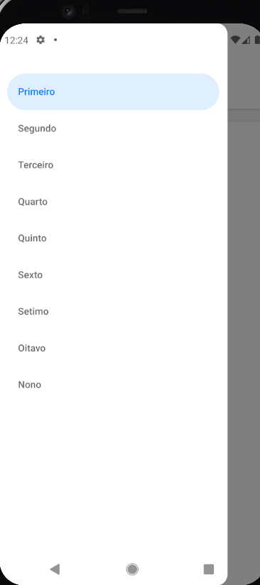

# MinhaGrade

Aplicativo Android que mostra quais disciplinas você pode cursar. Você marca as disciplinas que já concluiu e o app libera automaticamente as que tiveram todos os pré-requisitos cumpridos.

A primeira versão traz a grade completa do curso de **Economia da UFCG**: 42 disciplinas distribuídas em 9 períodos.

<table>
  <tr>
    <td align="center"><br><sub>Disciplinas do período</sub></td>
    <td align="center"><br><sub>Menu de períodos</sub></td>
  </tr>
</table>

## Funcionalidades

- **Navegação por período**: menu lateral com os 9 períodos do curso
- **Marcar disciplinas concluídas** com um toque
- **Status visual de cada disciplina**:
  - 🔵 azul: concluída
  - ⚪ cinza: liberada (pré-requisitos cumpridos)
  - transparente: bloqueada (ao tocar, o app avisa que faltam pré-requisitos)
- **Desmarcação em cascata**: se você desmarca uma disciplina, as que dependiam dela também são desmarcadas
- **Progresso salvo no celular**: as marcações ficam guardadas mesmo depois de fechar o app

## Como funciona

A grade do curso fica em `src/Grade/grade.json`. Cada disciplina tem um `id` e a lista de `id`s dos seus pré-requisitos:

```js
{ nome: 'Microeconomia I', id: '17', requisitos: ['1', '12'], estado: 0 }
```

Uma disciplina só pode ser marcada quando todos os seus requisitos estão com `estado: 1` (concluídos). Sempre que o estado muda, o app revalida a grade inteira e o resultado é salvo com AsyncStorage.

## Download

O APK para Android está disponível na aba [Releases](https://github.com/LucasByteX/MinhaGrade/releases).

## Tecnologias

| Área | Ferramentas |
|---|---|
| App | React Native 0.81, Expo SDK 54 |
| Navegação | React Navigation (Drawer) |
| Armazenamento local | AsyncStorage |
| Build | EAS Build |

## Estrutura

```
MinhaGrade/
├── App.js                        # navegação e persistência do progresso
├── src/
│   ├── Grade/grade.json          # disciplinas e pré-requisitos do curso
│   ├── pages/Disciplinas/        # lista de disciplinas de um período
│   │   └── Matriz/               # card de disciplina (cor, toque, validação)
│   └── icone/                    # ícones do app
├── assets/                       # splash e favicon
├── app.json                      # configuração do Expo
└── eas.json                      # configuração do EAS Build
```

## Como rodar

**Pré-requisitos:** Node.js, npm e o app **Expo Go** no celular (ou um emulador Android).

```bash
git clone https://github.com/LucasByteX/MinhaGrade.git
cd MinhaGrade
npm install
npx expo start
```

Depois é só ler o QR Code com o Expo Go.

## Próximos passos

- [ ] **Grade personalizável**: permitir que o usuário cadastre as disciplinas e os pré-requisitos de qualquer curso
- [ ] Grades prontas de outros cursos
- [ ] Indicador de progresso no curso

## Licença

Distribuído sob a licença MIT. Veja [LICENSE](./LICENSE).

## Autor

**Lucas Daris de Souza**, estudante de Engenharia de Computação no IFPB
[LinkedIn](https://www.linkedin.com/in/lucas-daris-879159288/) · [GitHub](https://github.com/LucasByteX)
